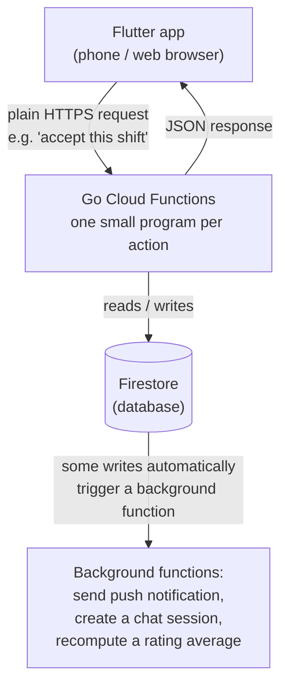

# Bridge Flex — Technical Overview (plain-language)

This document explains, in plain language, what Bridge Flex is, what it's built with, how the
pieces talk to each other, what data it stores, and how to get it running — both on a laptop for
development and for real, in production. It's written for someone new to the project, not
assuming Flutter/Go/Firebase experience.

For deeper technical detail once you're past this overview, see:
- **`ARCHITECTURE.md`** — the full engineering design (data model, security rules, the booking
  transaction logic, notification flow) written for a developer working in the code.
- **`backend/PRODUCTION_SETUP.md`** — the exact one-time cloud infrastructure setup steps.
- **`KNOWN_ISSUES.md`** — what's missing, stubbed, or still rough around the edges.
- **`CONFIG_AND_KEYS.md`** — what credentials/config exist and where.

---

## 1. What Bridge Flex is

Bridge Flex is a mobile/web app that connects **nurseries** (childcare settings) who need
last-minute staff cover with **staff** (nursery workers) looking for shifts. A nursery posts an
open shift; any qualified staff member can accept it (first person to accept gets it — no
double-booking); once booked, the two sides can chat inside the app; afterwards, they can rate each
other. There's also a trust layer: staff upload their DBS (background check) certificate, and an
admin reviews and approves it before it counts as "verified."

Two user types, one app: which screens someone sees depends on whether they signed up as a
**nursery** or as **staff** — there's no separate admin app; admin access is just a special
permission flag on a normal account.

## 2. Tech stack — what's used, and why

| Layer | Technology | In plain terms |
|---|---|---|
| Mobile/web app | **Flutter** (Dart) | One codebase that builds into an Android app, an iOS app, and a website. This is what the user sees and taps. |
| App state/navigation | Riverpod, go_router | Standard Flutter libraries for managing what's on screen and moving between screens. Not something you'd need to touch unless changing app behavior. |
| Backend logic | **Go**, running as **Cloud Functions** | Small, independent server programs (one per action — "accept a shift," "send a chat message," etc.) that Google's cloud runs on demand. There's no traditional "always-on server" to manage — Google starts one up when a request comes in and shuts it down when idle. |
| Database | **Firestore** (part of Firebase) | A cloud database, similar in spirit to a spreadsheet-of-documents rather than traditional SQL tables. Google fully manages it — no server to patch or back up manually. |
| File storage | **Firebase Storage** | Where uploaded files live — DBS certificates, ID documents, nursery photos. |
| Login/accounts | **Firebase Authentication** | Handles email/password sign-in and Google sign-in, issues secure login tokens. Bridge Flex's own code never touches raw passwords. |
| Push notifications | **Firebase Cloud Messaging (FCM)** | Sends the phone notifications users get (e.g. "Your shift was booked"). |
| Download website | **Firebase Hosting** | Serves the plain download page (`kvision-503115.web.app`) where the Android APK is downloaded from. |
| Cloud provider underneath it all | **Google Cloud Platform (GCP)** | Firebase is Google's product; GCP is the underlying cloud infrastructure it runs on. Project ID: `kvision-503115`. |

**Why this combination:** Firebase was chosen because it has a genuinely free tier for a
small-to-medium app (no card required until real scale is needed), and it bundles database, auth,
storage, and push notifications as one connected system rather than four separate vendors to wire
together. Go was chosen for the backend logic because it's what the team is strongest in — Firebase
also supports Node.js/Python for backend code, but this project doesn't use those.

## 3. How the pieces talk to each other



**In words:** the app never talks to the database directly. Every action (posting a shift,
accepting one, sending a chat message) is a plain web request from the app to one specific Go
function, which checks the user is allowed to do that, then reads/writes the database on their
behalf. Some database writes automatically trigger a second, background function — for example,
the moment a shift is marked "booked," a background function fires that sends both people a push
notification and creates their chat thread, without the app having to ask for that separately.

This "trigger a background function on a database write" mechanism is called **Eventarc** in
Google Cloud's terminology if you see that word elsewhere in the code/docs — functionally, just
think of it as "and then this other thing automatically happens."

**A day in the life of one shift**, end to end:
1. A nursery fills in a form in the app → `CreateShift` function writes a new shift into Firestore
   as `open`.
2. A staff member browses open shifts → the app calls `ListOpenShifts`, which reads straight from
   Firestore and returns the list.
3. Staff taps "Accept" → `AcceptShift` runs, checks nobody else already grabbed it, marks it
   `booked`. This is the one place double-booking is prevented — see §"the booking safeguard"
   below.
4. That write automatically triggers a background function that: sends both people a push
   notification, records an in-app notification, and creates a chat thread between them.
5. They chat inside the app (`SendChatMessage`/`ListChatMessages`).
6. After the shift, either side can leave a star rating (`CreateRating`), which automatically
   recomputes the other person's average rating.

**The booking safeguard, explained simply:** if two staff members tap "Accept" on the same shift
at almost the same instant, only one should win. The `AcceptShift` function uses a database
feature called a **transaction** — it's like a "first, check nobody else beat you to it, and if
they did, undo everything and tell the second person 'sorry, taken'" guarantee that the database
itself enforces, so this can't go wrong even under bad timing.

## 4. Database schema (plain-English)

Firestore stores data as named **collections**, each holding many **documents** (think: a
collection is like a named folder, a document is like one file/record in it, and each document is
just a set of named fields). Here's what exists and what each one is for:

| Collection | What it stores | Who can see it |
|---|---|---|
| `profiles` | A user's full private info — name, role (nursery/staff), exact location, qualifications, DBS status, rating, and (for nurseries) company details | Only that user — nobody else can read another user's `profiles` document at all |
| `profilesPublic` | A trimmed, safe-to-share copy of the above — same name/rating/qualifications, but an approximate area instead of an exact address | Any signed-in user (this is what you see when viewing someone else's profile) |
| `shifts` | Every posted shift — nursery, date/time, pay rate, status (open/booked/cancelled), and who's booked on it | Open shifts: any staff member. Booked shifts: only the nursery and the booked staff |
| `ratings` | Star ratings + comments left after a shift | Created by either party after a shift they were both on; can't be edited or deleted afterward |
| `chatSessions` (and the messages inside each one) | Chat threads, one per booked shift | Only the two people in that chat |
| `documents` | Metadata about uploaded files (DBS certificate, ID, qualifications) — the actual file lives in Firebase Storage, this just tracks its review status | The uploader, and admins reviewing it |
| `notifications` | In-app notification records (e.g. "Your shift was booked") | Only the recipient |
| `transactions` | Reserved for future payment records | Not used yet — payments aren't built (see `KNOWN_ISSUES.md`) |

**Why two profile collections instead of one:** the database's access-control system can only say
"yes you can read this whole document" or "no you can't" — it can't hide just one field (like exact
GPS location) while showing the rest. So the private, sensitive version (`profiles`) and a
public-safe, automatically-kept-in-sync copy (`profilesPublic`) are kept as two separate documents.
This was a deliberate fix early in the project after realizing the simpler one-collection version
would have let any signed-in user see everyone else's exact home/work location.

**No traditional foreign keys / joins:** Firestore isn't a relational database, so links between
documents are just an ID field pointing at another document's ID (e.g. a shift's `nurseryId` is
the nursery's `profiles` document ID) — the app/backend code looks things up by ID rather than the
database doing a SQL-style join.

## 5. Running it locally (for development)

Nothing here touches real user data or costs any money — it runs entirely against Google's free
local emulator, a program that pretends to be Firebase on your own machine.

**You'll need installed:** Go, Node.js, Java (the emulators need it), Flutter.

```bash
# 1. Backend
cd backend
npm install
npm run emulators:start        # starts the fake local database/auth/storage
# in another terminal:
npm run seed                   # creates sample nursery/staff/shift accounts to test with
# in more terminals — the backend needs a few processes running side by side:
npm run functions:core
npm run functions:communication
npm run functions:payments

# 2. Frontend, in another terminal
cd frontend
flutter pub get
flutter run -d <device> --dart-define=DEV_HOST=<your-computer's-LAN-IP>
```

Full detail, including exactly which sample accounts get created and their passwords, is in
`backend/README.md`.

## 6. Deploying it for real (production)

Production is already live today, on Google project `kvision-503115`. Two very different kinds of
"deployment" apply here:

**A. Pushing a code change to the already-existing production project** — the common case:
```bash
gcloud auth login
PROJECT_ID=kvision-503115 backend/deploy.sh
```
This one command deploys the database security rules and all ~40 backend functions. Takes a few
minutes. That's genuinely it for backend changes.

For the app itself: building a new Android APK and re-uploading it to the download website, or
pushing a new iOS build through the CI pipeline (`.github/workflows/build_ios.yml`).

**B. Setting up a brand-new Google/Firebase project from scratch** — a one-time, much longer
process (creating the project, picking a region, turning on the database/auth/storage, granting
the backend permission to actually use them, etc.), needed only if this ever moves to a different
Firebase project (e.g. a full account transfer that includes recreating infrastructure rather than
just changing who owns the existing one). Every step is written down in
`backend/PRODUCTION_SETUP.md` because most of it doesn't have a single push-button command —
several bugs earlier in this project's life came specifically from steps in that list being missed
silently (things looked "deployed successfully" while quietly not working for real users), so that
document exists to make sure nobody has to rediscover those the hard way again.

## 7. Where things live in the codebase

```
KVisionApp/
  frontend/            The Flutter app (what users install)
  backend/
    services/core/          Profiles, shifts, booking, ratings, documents, admin
    services/communication/ Chat, push notifications, in-app notifications
    services/payments/      Stub only — not built yet
    firestore.rules         The database's access-control rules (who can read/write what)
    deploy.sh                One command that deploys everything backend-related
    PRODUCTION_SETUP.md     One-time cloud infrastructure setup steps
  ARCHITECTURE.md       Full engineering design detail
  KNOWN_ISSUES.md        What's missing or not finished yet
  CONFIG_AND_KEYS.md     What credentials/config exist and where
```
